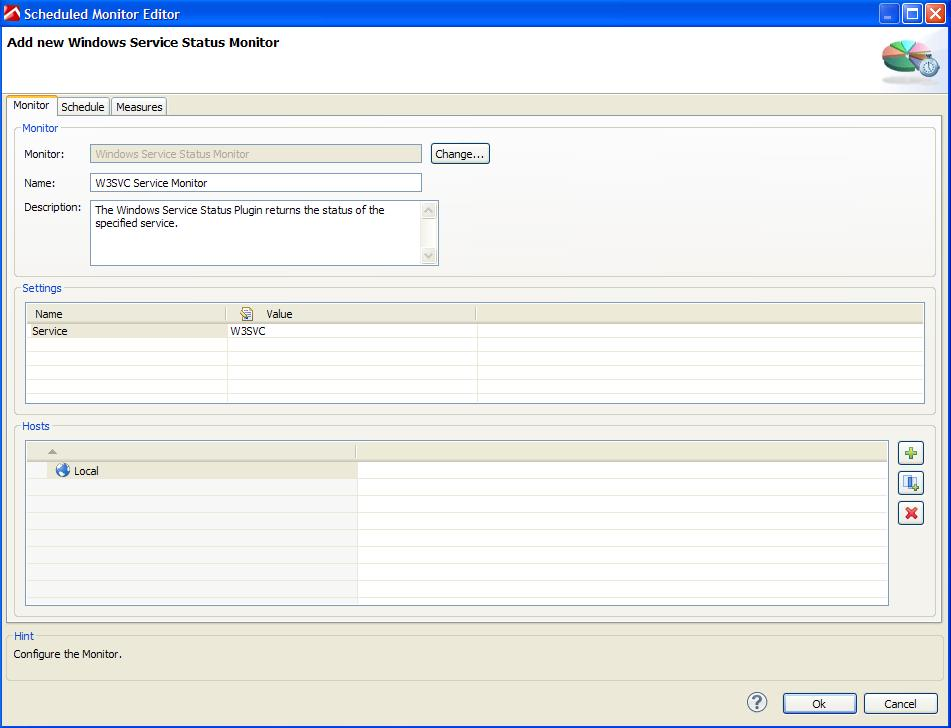
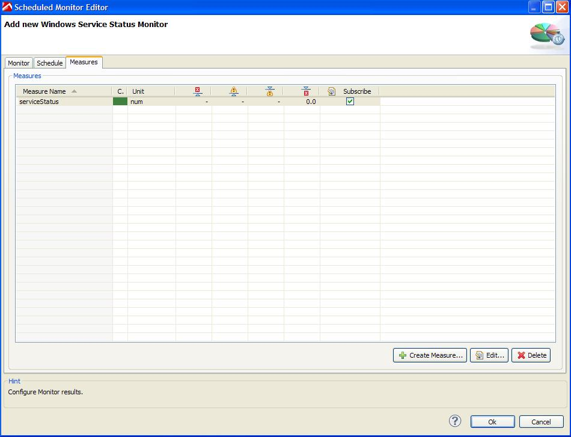

# Windows Service Status Monitor Plugin

## Overview

The plugin is querying the specified service on the given host(s) using the Windows SC command which communicates with the NT Service Controller and Services.  
If the service is started then the serviceStatus measure will record a "1". If the service is stopped it will return "0". In case of an access or other problem the plugin will fail to execute with an
error message indicating the problem.

Configuration screen for Windows Service Monitor

Measures provided by Windows Service Monitor

## Plugin Details

| Name | Windows Service Status Monitor Plugin
| :--- | :---
| Author | Derek Abing
| Supported dynaTrace Versions | >= 5.5
| License | [dynaTrace BSD](dynaTraceBSD.txt)
| Support | [Not Supported ](https://community.compuwareapm.com/community/display/DL/Support+Levels#SupportLevels-Community)  
| Release History | 2012-03-05 Initial Release
| Download | [Windows Service Status Monitor Plugin 1.0.0](com.dynatrace.diagnostics.plugins.WindowsServiceStatusPlugin_1.0.0.jar) 

## Provided Measures

  * **serviceStatus**: If the service is running, the measure will yield 1, otherwise 0. 

## Configuration

| Name | Value
| :--- | :---
| Service | The name of the service to monitor.

Since the plugin is using the SC command, this means that the logon account configured for the dynaTrace collector needs to have appropriate access to the host(s) you want to monitor (typically
Administrator access to the server). If the access isn't there, the monitor will fail with a detailed error message. A good way to test this is to log into the collector with the account it is running
as, open a command prompt and execute a SC command to the remote server you want to monitor.

## Installation

Import the Plugin into the dynaTrace Server. For details how to do this please refer to the [dynaTrace
documentation](https://community.compuwareapm.com/community/display/DOCDT61/Plugin+Management).

